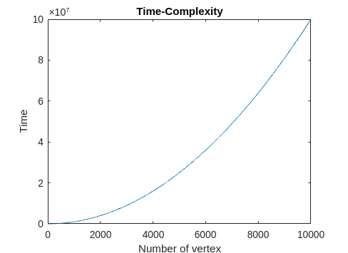

# DAA
# Assignment 6
**Team Members**
| Enrollment No. | Name            | Github-Id   |
| :---:          |      :----:     |        :---:|
| IIT2019210     |`Aditya Aggarwal`| Aditya-2001 |
| IIT2019211     | `Divy Agrawal`  | divy3011    |
| IIT2019212     | `Aman Rubey`    | amanrubey   |

**Group No ---** 9

**Faculty Name --- **Rahul Kala Sir

**Mentor Name --- **Md. Meraz Sir


***

## This is the readme.md file for our Assignment-06
---
## Problem Statement
Find Minimum Spanning Tree of a given graph using Prim's Algorithm.


## How to use code
```
#Download project
$ git clone https://github.com/divy3011/daa_assignment.git
```
Project Initialize
```
$ cd daa_assignment
$ cd Assignment-06

```
---

Run the code
```
$ g++ prims_mst.cpp -o prims_mst
$ ./prims_mst
```


**Test case**

```
Test Case-1
Input:
   5 8
   1 2 10
   1 4 22
   1 5 11
   2 3 11
   2 5 11
   3 4 22
   3 5 22
   4 5 10
Out:
   (1 , 2) --->  10
   (2 , 3) --->  11
   (5 , 4) --->  10
   (1 , 5) --->  11
#--------------------------#
Test Case-2
Input:
   6 10
   1 2 11
   1 6 20
   1 3 3
   1 4 22
   2 6 12
   3 6 1
   3 4 13
   3 5 4
   4 5 10
   5 6 6
Out:
   (1 , 2) --->  11
   (1 , 3) --->  3
   (5 , 4) --->  10
   (3 , 5) --->  4
   (3 , 6) --->  1
```

---

## INTRODUCTION
Prim's algorithm is a greedy algorithm that finds a minimum spanning tree for a weighted undirected graph. This means it finds a subset of the edges that forms a tree that includes every vertex, where the total weight of all the edges in the tree is minimized. 


## COMPLEXITY ANALYSIS
**Time-Complexity**

Let  V  denote  the  number  of  vertices  in  the  given  graph whose MST we have to find. Taking the reference of the Code, the outer for loop  of  the  Prim_Min_spanning_Tree()  function  is  running  V times and the getMinWeight() function is also running V times. Similarly the Inner for loop is also running V times.

Therefore,

```math
    T(V) = O(V∗(V+V)) + O(1)
```
Therefore, by using Master's Theorem
```math
    T(V) = O(V^2)
```
<figure style="text-align: center;">
  
</figure>


**Auxiliary Space-Complexity**

Let  V  denote  the  number  of  vertices  in  the  given  graph whose MST we have to find. Taking  the  reference  of  the Code,  we  have created  three  vectors  of  size  V  mainly  min_weight,  flag, min_spanning_tree.

Therefore,

```math
    T(V) = O(V)
```
<figure style="text-align: center;">
  
</figure>


***
## References
1. Introduction to Algorithms 3rd Edition by Clifford Stein, Thomas H. Cormen, Charles E. Leiserson, Ronald L. Rivest
2. Algorithm Design by J Kleinberg and E Tardos
4. [Prim's Algorithm](https://en.wikipedia.org/wiki/Prim\%27s_algorithm)
5. [Complexity Analysis](https://stackoverflow.com/questions/11032015/how-to-find-time-complexity-of-an-algorithm)
6. [IEEE Paper](https://www.overleaf.com/latex/templates/ieee-conference-template-example/nsncsyjfmpxy)
